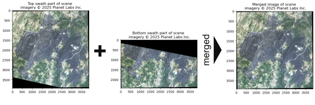
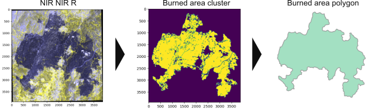

# Wildfire Propagation Database

## overview
This repository includes the code for pre-processing Dove-C satellite data and extracting GIS-readable burned area geometries semi-automatically. 
The pre-processing steps include
- Merging multiple Dove-C images from adjacent swath paths into a single image
- Stretching the data to ensure practical visualization
- Separating the burned area from the merged image
- Transforming the binary burned area matrix into a GIS readable polygon
- Save the resulting polygon

## Merging

The first step often includes merging Planet Labs Inc. images from different Dove-C satellite swath paths into a single image, as shown in the following example:

## Stretching

The data is stretched according to its band specific intensity values and scaled to values between 0 and 255. 
For the stretching, percentiles are defined as cutoff values, and every pixel below or above these values is set to the new respective minimum or maximum. The 2nd and 98th percentile are the pre-defined values.

## Separating the burned area and creating a GIS readable polygon

Thresholds on the NIR (or other) band are used to create a binary image with coherent clusters, from which the burned area is extracted and transformed into a GIS-readable polygon. 
The workflow is illustrated in this example:

## Example and code

The code folder in this repository contains a Jupyter notebook with a working example, the necessary images in an individual folder, as well as the utility functions for merging and stretching in a Python script.
